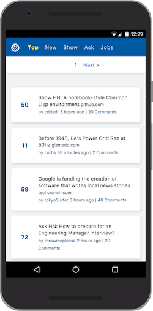
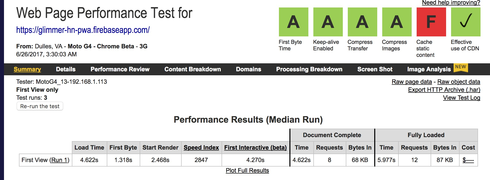
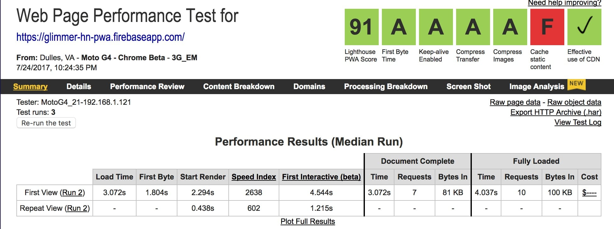
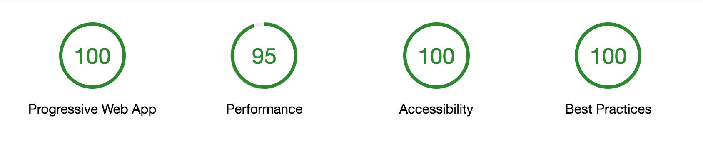

# Glimmer.js Hacker News Progressive Web App

This is an implementation of a progressive web app with Glimmer (Ember template engine). 
Here is the result

with webpagetest on 3G and EM: 

### [Performance Results (webpagetest EM):](https://www.webpagetest.org/result/170708_DK_bcd8d8c3da33a5f7badc29417f3b95c7/)

### [Performance Results (webpagetest 3G):](https://www.webpagetest.org/result/170708_34_1ae3fbe0c7f0f90ad0b46282ab2ce5a5/)

### and with [Lighthouse 2.2.1](https://glimmer-hn-pwa.firebaseapp.com/lighthouse.html)

## TODO
* Consider using official api to have realtime update
* Collapsible comment threads, with child counts
* Last visit details for stories are cached in localStorage
* try to optimize more
* Consider fast-boot
* Remove SW from Development 

## Installation

* `git clone <repository-url>` this repository
* `cd glimmer-hn-pwa`
* `yarn`

## Running / Development

* `npm start`
* Visit your app at [http://localhost:4200](http://localhost:4200).

### Building

* `ember build` (production)
* `ember build:prod` (production and Deploy to Firebase)

## [Contributing](CONTRIBUTING.MD)
Please feel free to open a PR and improve Glimmer PWA.

## Contributors
